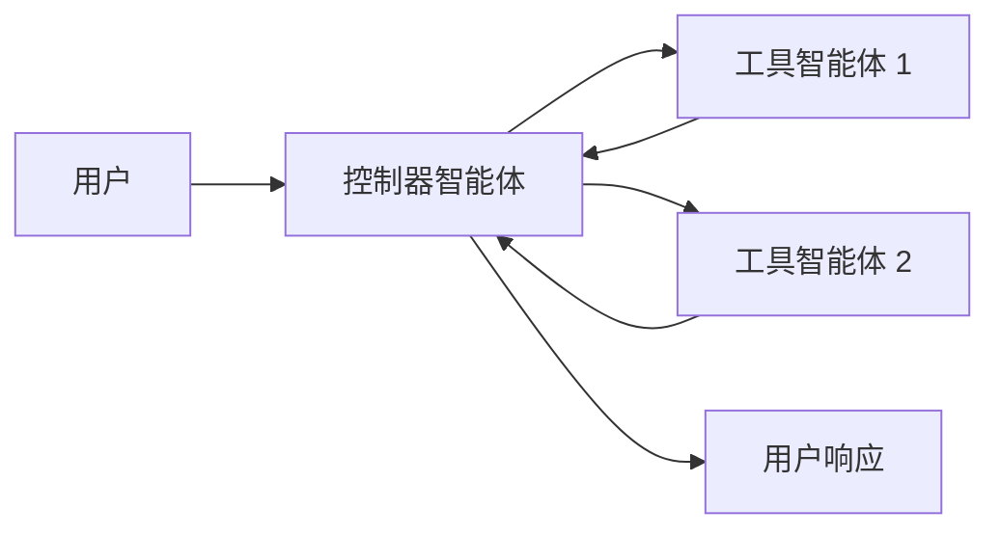
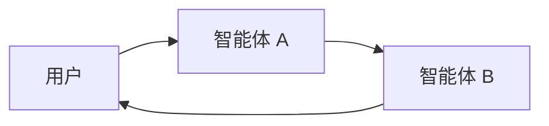

# 多智能体

**多智能体系统**将复杂的应用程序分解为多个专业化智能体，这些智能体协同工作解决问题。
与依赖单个智能体处理每个步骤不同，**多智能体架构**允许您将更小、更专注的智能体组合成协调的工作流程。

在以下情况下，多智能体系统非常有用：

*   单个智能体拥有太多工具，难以决定使用哪个。
*   上下文或内存变得过于庞大，单个智能体难以有效跟踪。
*   任务需要**专业化**（例如，规划师、研究员、数学专家）。

## 多智能体模式

| 模式                           | 工作原理                                                                                                                                                              | 控制流                                               | 使用示例                               |
| ------------------------------- | --------------------------------------------------------------------------------------------------------------------------------------------------------------------- | ---------------------------------------------------- | -------------------------------------- |
| [**工具调用**](#tool-calling) | 一个**主管**智能体将其他智能体作为*工具*调用。"工具"智能体不直接与用户对话——它们只运行任务并返回结果。                                     | 集中式：所有路由都经过调用智能体。             | 任务编排、结构化工作流程。             |
| [**交接**](#handoffs)         | 当前智能体决定**转移控制权**给另一个智能体。活动智能体发生变化，用户可以继续直接与新的智能体交互。                                       | 分散式：智能体可以更改活动智能体。             | 多领域对话、专家接管。                 |

<Card title="教程：构建主管智能体" icon="sitemap" href="/oss/python/langchain/supervisor" arrow cta="了解更多">
  了解如何使用主管模式构建个人助手，其中中央主管智能体协调专业化工作智能体。
  本教程演示：

  * 为不同领域（日历和电子邮件）创建专业化子智能体
  * 将子智能体包装为工具以实现集中编排
  * 为敏感操作添加人机循环审查
</Card>

## 选择模式

| 问题                                              | 工具调用 | 交接 |
| ------------------------------------------------- | -------- | ---- |
| 需要集中控制工作流程？                        | ✅ 是     | ❌ 否 |
| 希望智能体直接与用户交互？                     | ❌ 否     | ✅ 是 |
| 专家之间需要复杂、类人化的对话？               | ❌ 有限   | ✅ 强烈 |

<Tip>
  您可以混合使用这两种模式——使用**交接**进行智能体切换，并让每个智能体**调用子智能体作为工具**来完成专业化任务。
</Tip>

## 自定义智能体上下文

多智能体设计的核心是**上下文工程**——决定每个智能体可以看到什么信息。LangChain让您能够精细控制：

*   对话或状态的哪些部分传递给每个智能体。
*  专用于子智能体的定制化提示。
*  包含/排除中间推理过程。
*  为每个智能体自定义输入/输出格式。

您系统的**质量严重依赖于**上下文工程。目标是确保每个智能体能够访问执行任务所需的正确数据，无论它是作为工具还是作为活动智能体。

## 工具调用

在**工具调用**中，一个智能体（"**控制器**"）将其他智能体视为*工具*，在需要时调用。控制器负责编排，而工具智能体执行特定任务并返回结果。

流程：

1.  **控制器**接收输入并决定调用哪个工具（子智能体）。
2.  **工具智能体**根据控制器的指令运行其任务。
3.  **工具智能体**将结果返回给控制器。
4.  **控制器**决定下一步或结束。



<Tip>
  作为工具使用的智能体通常**不期望**继续与用户对话。
  它们的角色是执行任务并将结果返回给控制器智能体。
  如果需要子智能体能够与用户对话，请使用**交接**模式。
</Tip>

### 实现方式

以下是一个最小示例，其中主智能体通过工具定义获得对单个子智能体的访问：

```python  theme={null}
from langchain.tools import tool
from langchain.agents import create_agent

subagent1 = create_agent(model="...", tools=[...])

@tool(
    "subagent1_name",
    description="subagent1_description"
)
def call_subagent1(query: str):
    result = subagent1.invoke({
        "messages": [{"role": "user", "content": query}]
    })
    return result["messages"][-1].content

agent = create_agent(model="...", tools=[call_subagent1])
```

在这种模式中：

1.  主智能体在决定任务匹配子智能体的描述时调用 `call_subagent1`。
2.  子智能体独立运行并返回其结果。
3.  主智能体接收结果并继续编排。

### 自定义控制点

有几个地方可以控制上下文如何在主智能体和其子智能体之间传递：

1.  **子智能体名称** (`"subagent1_name"`)：这是主智能体引用子智能体的方式。由于它影响提示，请谨慎选择。
2.  **子智能体描述** (`"subagent1_description"`)：这是主智能体"知道"关于子智能体的信息。它直接影响主智能体决定何时调用它。
3.  **子智能体的输入**：您可以自定义此输入，更好地形成子智能体如何解释任务。在上面的示例中，我们直接传递智能体生成的 `query`。
4.  **子智能体的输出**：这是**响应**传递回主智能体的内容。您可以调整返回内容，控制主智能体如何解释结果。在上面的示例中，我们返回最终消息文本，但您可以返回额外的状态或元数据。

### 控制子智能体的输入

控制主智能体传递给子智能体的输入主要有两个杠杆：

*  **修改提示** – 调整主智能体的提示或工具元数据（即子智能体的名称和描述），以更好地引导它何时以及如何调用子智能体。
*  **上下文注入** – 通过调整工具调用以从智能体的状态中提取信息，添加在静态提示中难以捕获的输入（例如，完整消息历史、先前结果、任务元数据）。

```python  theme={null}
from langchain.agents import AgentState
from langchain.tools import tool, ToolRuntime

class CustomState(AgentState):
    example_state_key: str

@tool(
    "subagent1_name",
    description="subagent1_description"
)
def call_subagent1(query: str, runtime: ToolRuntime[None, CustomState]):
    # 应用任何需要的逻辑将消息转换为合适的输入
    subagent_input = some_logic(query, runtime.state["messages"])
    result = subagent1.invoke({
        "messages": subagent_input,
        # 您也可以根据需要在此处传递其他状态键。
        # 确保在主智能体和子智能体的状态模式中都定义这些内容。
        "example_state_key": runtime.state["example_state_key"]
    })
    return result["messages"][-1].content
```

### 控制子智能体的输出

塑造主智能体从子智能体接收回内容的两种常见策略：

*  **修改提示** – 优化子智能体的提示，指定应返回的确切内容。
    *   当输出不完整、过于冗长或缺少关键细节时很有用。
    *  一种常见的故障模式是子智能体执行工具调用或推理但**未将结果**包含在最终消息中。提醒它控制器（和用户）只看到最终输出，因此所有相关信息必须包含在那里。
*  **自定义输出格式** – 在将响应返回给主智能体之前，通过代码调整或丰富子智能体的响应。
    *   示例：除了最终文本外，还将特定的状态键返回给主智能体。
    *  这需要将结果包装在 [`Command`](https://reference.langchain.com/python/langgraph/types/#langgraph.types.Command)（或等效结构）中，以便您可以将自定义状态与子智能体的响应合并。

```python  theme={null}
from typing import Annotated
from langchain.agents import AgentState
from langchain.tools import InjectedToolCallId
from langgraph.types import Command

@tool(
    "subagent1_name",
    description="subagent1_description"
)
# 我们需要将 `tool_call_id` 传递给子智能体，以便它可以使用它来响应工具调用结果
def call_subagent1(
    query: str,
    tool_call_id: Annotated[str, InjectedToolCallId],
# 您需要返回一个 `Command` 对象以包含不仅仅是最终工具调用的内容
) -> Command:
    result = subagent1.invoke({
        "messages": [{"role": "user", "content": query}]
    })
    return Command(update={
        # 这是我们要返回的示例状态键
        "example_state_key": result["example_state_key"],
        "messages": [
            ToolMessage(
                content=result["messages"][-1].content,
                # 我们需要包含工具调用 ID，以便它与正确的工具调用匹配
                tool_call_id=tool_call_id
            )
        ]
    })
```

## 交接

在**交接**中，智能体可以直接将控制权相互传递。"活动"智能体会发生变化，用户与当前拥有控制权的智能体交互。

流程：

1.  **当前智能体**决定需要另一个智能体的帮助。
2.  它将控制权（和状态）传递给**下一个智能体**。
3.  **新智能体**直接与用户交互，直到它决定再次交接或完成。



### 实现方式（即将推出）

***

<Callout icon="pen-to-square" iconType="regular">
  [在 GitHub 上编辑此页面的源代码。](https://github.com/langchain-ai/docs/edit/main/src/oss/langchain/multi-agent.mdx)
</Callout>

<Tip icon="terminal" iconType="regular">
  [通过 MCP 将这些文档以编程方式连接](/use-these-docs)到 Claude、VSCode 等，以获得实时答案。
</Tip>