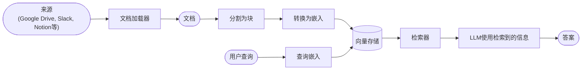
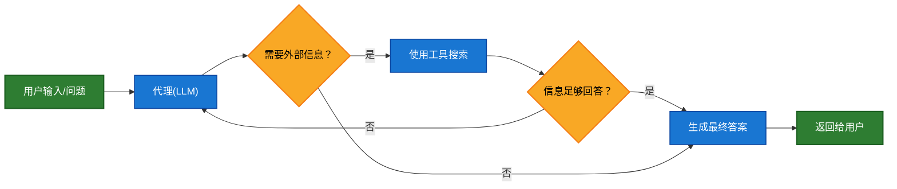
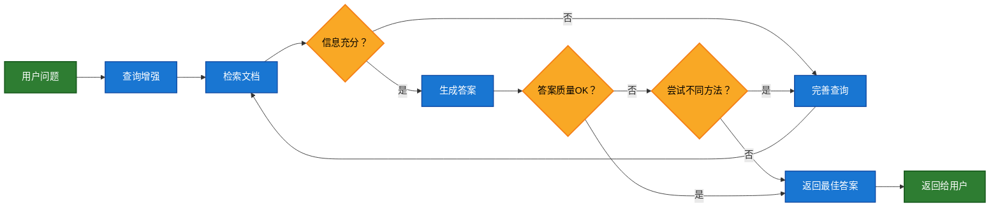

# 检索

大型语言模型(LLMs)功能强大，但有两个关键局限性：

* **有限上下文** — 无法一次性摄入整个语料库。
* **静态知识** — 其训练数据在某个时间点被冻结。

检索通过在查询时获取相关的外部知识来解决这些问题。这是**检索增强生成(RAG)**的基础：使用上下文特定信息增强LLM的答案。

## 构建知识库

**知识库**是在检索过程中使用的文档或结构化数据存储库。

如果您需要自定义知识库，可以使用LangChain的文档加载器和向量存储从您自己的数据构建一个。

<Note>
  如果您已经有知识库（例如SQL数据库、CRM系统或内部文档系统），您**不需要**重新构建它。您可以：

  * 在代理式RAG中将其作为**工具**连接到代理。
  * 查询它并将检索到的内容作为上下文提供给LLM [(两步RAG)](#2-step-rag)。
</Note>

请参阅以下教程，构建可搜索的知识库和最小化的RAG工作流：

<Card title="教程：语义搜索" icon="database" href="/oss/python/langchain/knowledge-base" arrow cta="了解更多">
  学习如何使用LangChain的文档加载器、嵌入技术和向量存储从您自己的数据创建可搜索的知识库。
  在本教程中，您将在PDF上构建一个搜索引擎，实现查询相关段落的检索。您还将在该引擎上实现一个最小化的RAG工作流程，以了解外部知识如何集成到LLM的推理中。
</Card>

### 从检索到RAG

检索允许LLM在运行时访问相关上下文。但大多数实际应用更进一步：它们**将检索与生成集成**，以产生有依据的、具有上下文感知能力的答案。

这就是**检索增强生成(RAG)**背后的核心理念。检索管道成为更广泛系统的基础，该系统结合了搜索与生成。

### 检索管道

典型的检索工作流程如下所示：



每个组件都是模块化的：您可以交换加载器、分割器、嵌入模型或向量存储，而无需重写应用程序的逻辑。

### 构建块

<Columns cols={2}>
  <Card title="文档加载器" icon="file-import" href="/oss/python/integrations/document_loaders" arrow cta="了解更多">
    从外部来源（Google Drive、Slack、Notion等）摄取数据，返回标准化的[`Document`](https://reference.langchain.com/python/langchain_core/documents/#langchain_core.documents.base.Document)对象。
  </Card>

  <Card title="文本分割器" icon="scissors" href="/oss/python/integrations/splitters" arrow cta="了解更多">
    将大型文档分割成更小的块，这些块可以被单独检索并适合模型的上下文窗口。
  </Card>

  <Card title="嵌入模型" icon="diagram-project" href="/oss/python/integrations/text_embedding" arrow cta="了解更多">
    嵌入模型将文本转换为数字向量，这样在向量空间中，语义相似的文本会相互靠近。
  </Card>

  <Card title="向量存储" icon="database" href="/oss/python/integrations/vectorstores/" arrow cta="了解更多">
    用于存储和搜索嵌入的专业化数据库。
  </Card>

  <Card title="检索器" icon="binoculars" href="/oss/python/integrations/retrievers/" arrow cta="了解更多">
    检索器是一种接口，根据非结构化查询返回文档。
  </Card>
</Columns>

## RAG架构

根据系统需求，RAG可以通过多种方式实现。我们在下面的章节中概述每种类型。

| 架构类型 | 描述 | 控制力 | 灵活性 | 延迟 | 示例用例 |
| --------------- | -------------------------------------------------------------------------- | --------- | ----------- | ---------- | ------------------------------------------------- |
| **两步RAG** | 检索总是在生成之前执行。简单且可预测 | ✅ 高 | ❌ 低 | ⚡ 快速 | 常见问题解答、文档机器人 |
| **代理式RAG** | 由LLM驱动的代理在推理过程中决定*何时*和*如何*检索 | ❌ 低 | ✅ 高 | ⏳ 可变 | 可访问多种工具的研究助手 |
| **混合式RAG** | 结合两种方法的特点，并包含验证步骤 | ⚖️ 中等 | ⚖️ 中等 | ⏳ 可变 | 具有质量验证的领域特定问答 |

<Info>
  **延迟**：在**两步RAG**中，延迟通常更加**可预测**，因为最大LLM调用次数是已知且有限的。这种可预测性假设LLM推理时间是主导因素。然而，实际延迟也可能受到检索步骤性能的影响——如API响应时间、网络延迟或数据库查询——这些可能会根据使用的工具和基础设施而变化。
</Info>

### 两步RAG

在**两步RAG**中，检索步骤总是在生成步骤之前执行。这种架构简单且可预测，适用于许多将相关文档检索视为生成答案明确先决条件的应用场景。


<Card title="教程：检索增强生成(RAG)" icon="robot" href="/oss/python/langchain/rag#rag-chains" arrow cta="了解更多">
  了解如何构建一个问答聊天机器人，使用检索增强生成技术回答基于您数据的问题。
  本教程涵盖两种方法：

  * **RAG代理**：使用灵活工具运行搜索——适用于通用用途。
  * **两步RAG**：每个查询只需一次LLM调用——对于简单任务快速高效。
</Card>

### 代理式RAG

**代理式检索增强生成(RAG)**结合了检索增强生成的优势和基于代理的推理能力。而不是在回答前检索文档，一个代理（由LLM驱动）逐步推理，并在交互过程中决定**何时**和**如何**检索信息。

<Tip>
  代理启用RAG行为所需的唯一条件是能够访问一个或多个可获取外部知识的**工具**——如文档加载器、Web API或数据库查询。
</Tip>



```python  theme={null}
import requests
from langchain.tools import tool
from langchain.chat_models import init_chat_model
from langchain.agents import create_agent


@tool
def fetch_url(url: str) -> str:
    """从URL获取文本内容"""
    response = requests.get(url, timeout=10.0)
    response.raise_for_status()
    return response.text

system_prompt = """\
当您需要从网页获取信息时，请使用fetch_url；引用相关片段。
"""

agent = create_agent(
    model="claude-sonnet-4-0",
    tools=[fetch_url], # 用于检索的工具 [!code highlight]
    system_prompt=system_prompt,
)
```

<Expandable title="扩展示例：用于LangGraph的llms.txt的代理式RAG">
  本示例实现了一个**代理式RAG系统**，帮助用户查询LangGraph文档。代理首先加载[llms.txt](https://llmstxt.org/)，其中列出了可用的文档URL，然后可以根据用户问题动态使用`fetch_documentation`工具检索并处理相关内容。

  ```python  theme={null}
  import requests
  from langchain.agents import create_agent
  from langchain.messages import HumanMessage
  from langchain.tools import tool
  from markdownify import markdownify


  ALLOWED_DOMAINS = ["https://langchain-ai.github.io/"]
  LLMS_TXT = 'https://langchain-ai.github.io/langgraph/llms.txt'


  @tool
  def fetch_documentation(url: str) -> str:  # [!code highlight]
      """从URL获取并转换文档"""
      if not any(url.startswith(domain) for domain in ALLOWED_DOMAINS):
          return (
              "错误：不允许的URL。 "
              f"必须以下列之一开头：{', '.join(ALLOWED_DOMAINS)}"
          )
      response = requests.get(url, timeout=10.0)
      response.raise_for_status()
      return markdownify(response.text)


  # 我们将预先获取llms.txt的内容，这样无需进行LLM请求即可完成。
  llms_txt_content = requests.get(LLMS_TXT).text

  # 代理的系统提示
  system_prompt = f"""
  您是一位专业的Python开发人员和技术助手。
  您的主要角色是帮助用户解答关于LangGraph及相关工具的问题。

  指令：

  1. 如果用户提出您不确定的问题——或可能涉及API使用、
     行为或配置的问题——您必须使用`fetch_documentation`工具查阅相关文档。
  2. 引用文档时，请清晰地总结并包含内容中的相关上下文。
  3. 不要使用允许域之外的任何URL。
  4. 如果文档获取失败，请告知用户并继续您最佳的专业理解。

  您可以从以下已批准的来源访问官方文档：

  {llms_txt_content}

  您必须在回答用户关于LangGraph的问题之前，
  查阅文档以获取最新文档。

  您的回答应该清晰、简洁且技术准确。
  """

  tools = [fetch_documentation]

  model = init_chat_model("claude-sonnet-4-0", max_tokens=32_000)

  agent = create_agent(
      model=model,
      tools=tools,  # [!code highlight]
      system_prompt=system_prompt,  # [!code highlight]
      name="代理式RAG",
  )

  response = agent.invoke({
      'messages': [
          HumanMessage(content=(
              "编写一个使用预构建的create react agent的langgraph代理的简短示例。"
              "该代理应该能够查找股票定价信息。"
          ))
      ]
  })

  print(response['messages'][-1].content)
  ```
</Expandable>

<Card title="教程：检索增强生成(RAG)" icon="robot" href="/oss/python/langchain/rag" arrow cta="了解更多">
  了解如何构建一个问答聊天机器人，使用检索增强生成技术回答基于您数据的问题。
  本教程涵盖两种方法：

  * **RAG代理**：使用灵活工具运行搜索——适用于通用用途。
  * **两步RAG**：每个查询只需一次LLM调用——对于简单任务快速高效。
</Card>

### 混合式RAG

混合式RAG结合了两步RAG和代理式RAG的特点。它引入了中间步骤，如查询预处理、检索验证和生成后检查。这些系统比固定管道更具灵活性，同时保持对执行的一定控制。

典型组件包括：

* **查询增强**：修改输入问题以提高检索质量。这可能涉及重写不明确的查询、生成多个变体或用额外上下文扩展查询。
* **检索验证**：评估检索到的文档是否相关且充分。如果不是，系统可以完善查询并重新检索。
* **答案验证**：检查生成的答案是否准确、完整并与源内容一致。如果需要，系统可以重新生成或修改答案。

该架构通常支持这些步骤之间的多次迭代：



这种架构适用于：

* 模糊或未明确指定查询的应用
* 需要验证或质量控制步骤的系统
* 涉及多个来源或迭代完善的工作流

<Card title="教程：带自我修正的代理式RAG" icon="robot" href="/oss/python/langgraph/agentic-rag" arrow cta="了解更多">
  结合代理推理、检索和自我修正的**混合式RAG**示例。
</Card>

***

<Callout icon="pen-to-square" iconType="regular">
  [在GitHub上编辑此页面源代码。](https://github.com/langchain-ai/docs/edit/main/src/oss/langchain/retrieval.mdx)
</Callout>

<Tip icon="terminal" iconType="regular">
  [通过MCP以编程方式连接这些文档](/use-these-docs)到Claude、VSCode等，获取实时答案。
</Tip>