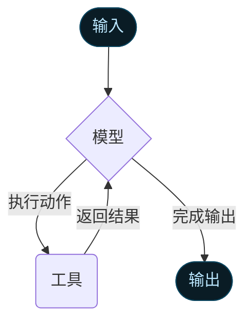

# 智能体（Agents）

智能体将语言模型与 [工具（tools）](/oss/python/langchain/tools) 相结合，构建出能**理解任务、决定使用哪些工具并逐步推理求解**的系统。

[`create_agent`](https://reference.langchain.com/python/langchain/agents/#langchain.agents.create_agent) 提供了可直接投入生产使用的智能体实现。

[LLM 智能体会循环调用工具以达成目标](https://simonwillison.net/2025/Sep/18/agents/)。
智能体会持续运行，直到满足终止条件——例如模型生成最终输出，或达到最大迭代次数。



<Info>
[`create_agent`](https://reference.langchain.com/python/langchain/agents/#langchain.agents.create_agent) 基于 [LangGraph](/oss/python/langgraph/overview) 构建了一个**图结构（graph-based）**的智能体运行时。  
图由节点（步骤）和边（连接）组成，用于定义智能体的信息处理流程。  
智能体会沿图移动，执行不同的节点，如模型节点（调用模型）、工具节点（执行工具）或中间件节点。  

详细了解 [Graph API](/oss/python/langgraph/graph-api)。 </Info>

---

## 核心组件

### 模型（Model）

[模型](/oss/python/langchain/models) 是智能体的推理引擎，可静态或动态配置。

#### 静态模型

静态模型在创建智能体时设定，运行期间保持不变。这是最常见也最简单的方式。

通过模型标识字符串初始化模型（格式为 `provider:model`，如 `openai:gpt-5`）：

```python
from langchain.agents import create_agent

agent = create_agent(
    "openai:gpt-5",
    tools=tools
)
```

<Tip>
支持自动推断模型提供方（如 `"gpt-5"` 会自动解析为 `"openai:gpt-5"`）。  
参考 [模型标识映射表](https://reference.langchain.com/python/langchain/models/#langchain.chat_models.init_chat_model)。
</Tip>

若需自定义配置，可直接实例化模型：

```python
from langchain.agents import create_agent
from langchain_openai import ChatOpenAI

model = ChatOpenAI(
    model="gpt-5",
    temperature=0.1,
    max_tokens=1000,
    timeout=30
)
agent = create_agent(model, tools=tools)
```

模型实例可完全控制参数，如 `temperature`、`max_tokens`、`timeout`、`base_url` 等。
详情见 [模型配置参数](/oss/python/langchain/models#parameters)。

#### 动态模型

动态模型可在运行时根据当前状态和上下文选择不同模型，用于复杂任务分流或成本优化。

示例：基于会话长度选择不同模型：

```python
from langchain_openai import ChatOpenAI
from langchain.agents import create_agent
from langchain.agents.middleware import wrap_model_call, ModelRequest, ModelResponse

basic_model = ChatOpenAI(model="gpt-4o-mini")
advanced_model = ChatOpenAI(model="gpt-4o")

@wrap_model_call
def dynamic_model_selection(request: ModelRequest, handler) -> ModelResponse:
    message_count = len(request.state["messages"])
    request.model = advanced_model if message_count > 10 else basic_model
    return handler(request)

agent = create_agent(
    model=basic_model,
    tools=tools,
    middleware=[dynamic_model_selection]
)
```

<Warning>
使用结构化输出时，**不支持预绑定工具的模型**（即调用过 `bind_tools` 的模型）。
</Warning>

---

### 工具（Tools）

工具赋予智能体执行动作的能力。智能体不仅能绑定模型工具，还能：

* 连续调用多个工具；
* 并行执行；
* 动态选择；
* 自动重试与异常处理；
* 在调用间保持状态。

定义工具示例：

```python
from langchain.tools import tool
from langchain.agents import create_agent

@tool
def search(query: str) -> str:
    return f"Results for: {query}"

@tool
def get_weather(location: str) -> str:
    return f"Weather in {location}: Sunny, 72°F"

agent = create_agent(model, tools=[search, get_weather])
```

若未传入工具列表，智能体仅包含单一 LLM 节点。

#### 工具错误处理

可用中间件自定义错误处理：

```python
from langchain.agents.middleware import wrap_tool_call
from langchain_core.messages import ToolMessage

@wrap_tool_call
def handle_tool_errors(request, handler):
    try:
        return handler(request)
    except Exception as e:
        return ToolMessage(
            content=f"Tool error: 请检查输入并重试。({str(e)})",
            tool_call_id=request.tool_call["id"]
        )
```

---

### 系统提示词（System Prompt）

通过系统提示可指定智能体行为：

```python
agent = create_agent(
    model,
    tools,
    system_prompt="你是一个高效且准确的助手。"
)
```

也可动态生成系统提示：

```python
from typing import TypedDict
from langchain.agents.middleware import dynamic_prompt, ModelRequest

class Context(TypedDict):
    user_role: str

@dynamic_prompt
def user_role_prompt(request: ModelRequest) -> str:
    role = request.runtime.context.get("user_role", "user")
    base = "你是一个有帮助的助手。"
    return base + ("请提供技术细节。" if role == "expert" else "请简明解释概念。")

agent = create_agent(
    model="openai:gpt-4o",
    tools=[web_search],
    middleware=[user_role_prompt],
    context_schema=Context
)
```

---

### 调用（Invocation）

智能体可通过 `invoke()` 执行：

```python
result = agent.invoke({
    "messages": [{"role": "user", "content": "旧金山的天气怎样？"}]
})
```

支持流式输出以实时展示执行过程。

---

### 高级特性

#### 结构化输出（Structured Output）

若希望输出固定格式，可使用：

**ToolStrategy（工具策略）**
通过伪工具调用生成结构化输出：

```python
from pydantic import BaseModel
from langchain.agents.structured_output import ToolStrategy

class ContactInfo(BaseModel):
    name: str
    email: str
    phone: str
```

**ProviderStrategy（提供方策略）**
使用模型原生结构化输出（如 OpenAI）：

```python
from langchain.agents.structured_output import ProviderStrategy
agent = create_agent(
    model="openai:gpt-4o",
    response_format=ProviderStrategy(ContactInfo)
)
```

---

### 记忆（Memory）

智能体自动维护会话历史，并支持自定义状态结构（`AgentState`）。

自定义状态示例：

```python
from langchain.agents import AgentState

class CustomState(AgentState):
    user_preferences: dict

agent = create_agent(
    model,
    tools=tools,
    state_schema=CustomState
)
```

---

### 流式输出（Streaming）

若执行多步任务，可实时输出中间结果：

```python
for chunk in agent.stream({
    "messages": [{"role": "user", "content": "搜索AI新闻并总结"}]
}, stream_mode="values"):
    latest = chunk["messages"][-1]
    print(latest.content or f"正在调用工具: {[t['name'] for t in latest.tool_calls]}")
```

---

### 中间件（Middleware）

中间件可在不同阶段拦截智能体执行流程，实现：

* 状态预处理（如截断消息、注入上下文）
* 模型响应校验（如安全过滤）
* 工具错误自定义处理
* 动态模型选择
* 日志与监控

中间件无需修改核心逻辑即可灵活扩展智能体。

---

<Callout icon="pen-to-square" iconType="regular">
  [在 GitHub 上编辑本文档](https://github.com/langchain-ai/docs/edit/main/src/oss/langchain/agents.mdx)
</Callout>

<Tip icon="terminal" iconType="regular">
  [通过 MCP 接口](/use-these-docs) 将这些文档连接至 Claude、VSCode 等，实现实时交互。
</Tip>
