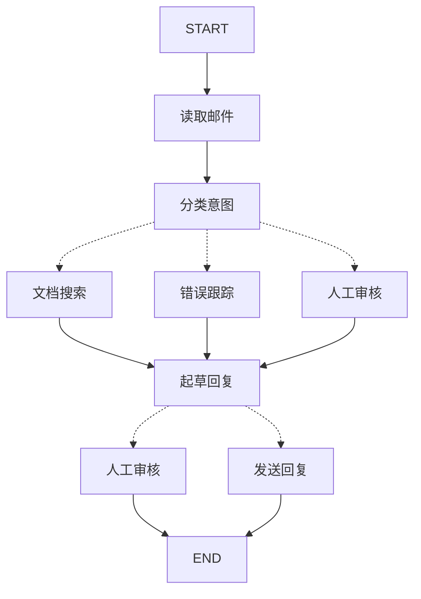

# 用LangGraph思考

> 通过将客户支持邮件Agent分解为离散步骤，学习如何构建Agent的思维过程

LangGraph可以改变您构建Agent的思维方式。当您使用LangGraph构建Agent时，首先需要将其分解称为**节点**的离散步骤。然后，您将为每个节点描述不同的决策和转换。最后，您将通过一个共享的**状态**将节点连接起来，每个节点都可以从中读取和写入。在本教程中，我们将引导您完成使用LangGraph构建客户支持邮件Agent的思维过程。

## 从您想要自动化的流程开始

假设您需要构建一个处理客户支持邮件的AIAgent。您的产品团队向您提出了以下要求：

Agent应该：
* 读取传入的客户邮件
* 根据紧急程度和主题对其进行分类
* 搜索相关文档以回答问题
* 起草适当的回复
* 将复杂问题升级给人工Agent
* 在需要时安排后续跟进

需要处理的示例场景：
1. 简单的产品问题："如何重置我的密码？"
2. 错误报告："选择PDF格式时，导出功能崩溃"
3. 紧急计费问题："我的订阅被扣费了两次！"
4. 功能请求："您能否为移动应用添加暗黑模式？"
5. 复杂的技术问题："我们的API集成间歇性地失败，出现504错误"

要在LangGraph中实现Agent，您通常遵循相同的五个步骤。

## 步骤1：将您的工作流程映射为离散步骤

首先识别您流程中的不同步骤。每个步骤将成为一个**节点**（执行特定功能的函数）。然后绘制这些步骤如何相互连接。



箭头显示可能的路径，但实际上选择哪条路径的决定发生在每个节点内部。

现在您已经识别了工作流程中的组件，让我们了解每个节点需要做什么：
* **读取邮件**：提取和解析邮件内容
* **分类意图**：使用LLM对紧急程度和主题进行分类，然后路由到适当的操作
* **文档搜索**：查询您的知识库以获取相关信息
* **错误跟踪**：在跟踪系统中创建或更新问题
* **起草回复**：生成适当的回复
* **人工审核**：升级给人工Agent进行审批或处理
* **发送回复**：发送邮件回复

<Tip>
  注意，一些节点会决定下一步去哪里（分类意图、起草回复、人工审核），而其他节点总是继续相同的下一步（读取邮件总是到分类意图，文档搜索总是到起草回复）。
</Tip>

## 步骤2：确定每个步骤需要做什么

对于您图中的每个节点，确定它代表什么类型的操作以及它需要什么上下文才能正常工作。

<CardGroup cols={2}>
  <Card title="LLM步骤" icon="brain" href="#llm-steps">
    当您需要理解、分析、生成文本或进行推理决策时使用
  </Card>

  <Card title="数据步骤" icon="database" href="#data-steps">
    当您需要从外部源检索信息时使用
  </Card>

  <Card title="操作步骤" icon="bolt" href="#action-steps">
    当您需要执行外部操作时使用
  </Card>

  <Card title="用户输入步骤" icon="user" href="#user-input-steps">
    当您需要人工干预时使用
  </Card>
</CardGroup>

### LLM步骤

当一个步骤需要理解、分析、生成文本或进行推理决策时：

<AccordionGroup>
  <Accordion title="分类意图节点">
    * 静态上下文（提示）：分类类别、紧急程度定义、响应格式
    * 动态上下文（来自状态）：邮件内容、发件人信息
    * 期望结果：确定路由的结构化分类
  </Accordion>

  <Accordion title="起草回复节点">
    * 静态上下文（提示）：语调指南、公司政策、回复模板
    * 动态上下文（来自状态）：分类结果、搜索结果、客户历史
    * 期望结果：准备审核的专业邮件回复
  </Accordion>
</AccordionGroup>

### 数据步骤

当一个步骤需要从外部源检索信息时：

<AccordionGroup>
  <Accordion title="文档搜索节点">
    * 参数：从意图和主题构建的查询
    * 重试策略：是，对暂时性故障使用指数退避
    * 缓存：可以缓存常见查询以减少API调用
  </Accordion>

  <Accordion title="客户历史查找">
    * 参数：来自状态的客户电子邮件或ID
    * 重试策略：是，但如果不可用则回退到基本信息
    * 缓存：是，带有生存时间以平衡新鲜度和性能
  </Accordion>
</AccordionGroup>

### 操作步骤

当一个步骤需要执行外部操作时：

<AccordionGroup>
  <Accordion title="发送回复节点">
    * 执行时机：获得批准后（人工或自动）
    * 重试策略：是，对网络问题使用指数退避
    * 不应缓存：每次发送都是唯一操作
  </Accordion>

  <Accordion title="错误跟踪节点">
    * 执行时机：当意图为"错误"时总是执行
    * 重试策略：是，关键是不要丢失错误报告
    * 返回：包含在响应中的票证ID
  </Accordion>
</AccordionGroup>

### 用户输入步骤

当一个步骤需要人工干预时：

<AccordionGroup>
  <Accordion title="人工审核节点">
    * 决策上下文：原始邮件、草稿回复、紧急程度、分类
    * 预期输入格式：布尔值加上可选的编辑回复
    * 触发时机：高紧急程度、复杂问题或质量问题
  </Accordion>
</AccordionGroup>

## 步骤3：设计您的状态

状态是Agent中所有节点都可访问的共享[内存](/oss/python/concepts/memory)。将其视为Agent使用的笔记本，用于跟踪它处理过程中学到和决定的一切。

### 什么应该包含在状态中？

对每条数据问自己这些问题：

<CardGroup cols={2}>
  <Card title="包含在状态中" icon="check">
    它是否需要跨步骤持久存在？如果是，则将其放入状态中。
  </Card>

  <Card title="不存储" icon="code">
    您可以从其他数据派生它吗？如果是，则按需计算而不是存储在状态中。
  </Card>
</CardGroup>

对于我们的邮件Agent，我们需要跟踪：
* 原始邮件和发件人信息（无法重建这些）
* 分类结果（多个下游节点需要）
* 搜索结果和客户数据（重新获取成本高）
* 草稿回复（需要通过审核持久存在）
* 执行元数据（用于调试和恢复）

### 保持状态原始，按需格式化提示

<Tip>
  一个关键原则：您的状态应该存储原始数据，而不是格式化文本。在需要时在节点内部格式化提示。
</Tip>

这种分离意味着：
* 不同的节点可以根据需要以不同方式格式化相同的数据
* 您可以更改提示模板而无需修改状态架构
* 调试更清晰 - 您确切地看到每个节点接收了什么数据
* 您的Agent可以在不破坏现有状态的情况下发展

让我们定义我们的状态：

```python
from typing import TypedDict, Literal

# 定义邮件分类的结构
class EmailClassification(TypedDict):
    intent: Literal["question", "bug", "billing", "feature", "complex"]
    urgency: Literal["low", "medium", "high", "critical"]
    topic: str
    summary: str

class EmailAgentState(TypedDict):
    # 原始邮件数据
    email_content: str
    sender_email: str
    email_id: str

    # 分类结果
    classification: EmailClassification | None

    # 原始搜索/API结果
    search_results: list[str] | None  # 原始文档块列表
    customer_history: dict | None  # 来自CRM的原始客户数据

    # 生成的内容
    draft_response: str | None
    messages: list[str] | None
```

注意，状态只包含原始数据 - 没有提示模板，没有格式化字符串，没有指令。分类输出作为单个字典存储，直接来自LLM。

## 步骤4：构建您的节点

现在我们将每个步骤实现为函数。LangGraph中的节点只是一个Python函数，它接收当前状态并返回对它的更新。

### 适当处理错误

不同的错误需要不同的处理策略：

| 错误类型                                                      | 谁修复它       | 策略                           | 使用时机                                      |
| --------------------------------------------------------------- | ------------------ | ---------------------------------- | ------------------------------------------------ |
| 暂时性错误（网络问题、速率限制）                  | 系统（自动） | 重试策略                       | 通常通过重试可解决的临时故障 |
| LLM可恢复的错误（工具故障、解析问题）              | LLM                | 将错误存储在状态中并循环回来 | LLM可以看到错误并调整其方法    |
| 用户可修复的错误（缺少信息、不明确的指令） | 人类              | 使用`interrupt()`暂停                       | 需要用户输入才能继续                       |
| 意外错误                                               | 开发人员          | 让它们冒泡                 | 需要调试的未知问题               |

<Tabs>
  <Tab title="暂时性错误" icon="rotate">
    添加重试策略以自动重试网络问题和速率限制：

    ```python
    from langgraph.types import RetryPolicy

    workflow.add_node(
        "search_documentation",
        search_documentation,
        retry_policy=RetryPolicy(max_attempts=3, initial_interval=1.0)
    )
    ```
  </Tab>

  <Tab title="LLM可恢复" icon="brain">
    将错误存储在状态中并循环回来，以便LLM可以看到出了什么问题并重试：

    ```python
    from langgraph.types import Command


    def execute_tool(state: State) -> Command[Literal["agent", "execute_tool"]]:
        try:
            result = run_tool(state['tool_call'])
            return Command(update={"tool_result": result}, goto="agent")
        except ToolError as e:
            # 让LLM看到出了什么问题并重试
            return Command(
                update={"tool_result": f"工具错误: {str(e)}"},
                goto="agent"
            )
    ```
  </Tab>

  <Tab title="用户可修复" icon="user">
    当需要时暂停并从用户那里收集信息（如账户ID、订单号或澄清）：

    ```python
    from langgraph.types import Command


    def lookup_customer_history(state: State) -> Command[Literal["draft_response"]]:
        if not state.get('customer_id'):
            user_input = interrupt({
                "message": "需要客户ID",
                "request": "请提供客户的账户ID以查找其订阅历史"
            })
            return Command(
                update={"customer_id": user_input['customer_id']},
                goto="lookup_customer_history"
            )
        # 现在进行查找
        customer_data = fetch_customer_history(state['customer_id'])
        return Command(update={"customer_history": customer_data}, goto="draft_response")
    ```
  </Tab>

  <Tab title="意外" icon="triangle-exclamation">
    让它们冒泡以进行调试。不要捕获您无法处理的内容：

    ```python
    def send_reply(state: EmailAgentState):
        try:
            email_service.send(state["draft_response"])
        except Exception:
            raise  # 显示意外错误
    ```
  </Tab>
</Tabs>

### 实现我们的邮件Agent节点

我们将每个节点实现为简单函数。记住：节点接收状态，执行工作，然后返回更新。

<AccordionGroup>
  <Accordion title="读取和分类节点" icon="brain">
    ```python
    from typing import Literal
    from langgraph.graph import StateGraph, START, END
    from langgraph.types import interrupt, Command, RetryPolicy
    from langchain_openai import ChatOpenAI
    from langchain_core.messages import HumanMessage

    llm = ChatOpenAI(model="gpt-4")

    def read_email(state: EmailAgentState) -> dict:
        """提取和解析邮件内容"""
        # 在生产环境中，这将连接到您的邮件服务
        return {
            "messages": [HumanMessage(content=f"处理邮件: {state['email_content']}")]
        }

    def classify_intent(state: EmailAgentState) -> Command[Literal["search_documentation", "human_review", "draft_response", "bug_tracking"]]:
        """使用LLM对邮件意图和紧急程度进行分类，然后相应路由"""

        # 创建返回EmailClassification字典的结构化LLM
        structured_llm = llm.with_structured_output(EmailClassification)

        # 按需格式化提示，而不是存储在状态中
        classification_prompt = f"""
        分析此客户邮件并对其进行分类：

        邮件: {state['email_content']}
        来自: {state['sender_email']}

        提供包括意图、紧急程度、主题和摘要的分类结果。
        """

        # 直接获取结构化响应作为字典
        classification = structured_llm.invoke(classification_prompt)

        # 根据分类确定下一个节点
        if classification['intent'] == 'billing' or classification['urgency'] == 'critical':
            goto = "human_review"
        elif classification['intent'] in ['question', 'feature']:
            goto = "search_documentation"
        elif classification['intent'] == 'bug':
            goto = "bug_tracking"
        else:
            goto = "draft_response"

        # 将分类作为单个字典存储在状态中
        return Command(
            update={"classification": classification},
            goto=goto
        )
    ```
  </Accordion>

  <Accordion title="搜索和跟踪节点" icon="database">
    ```python
    def search_documentation(state: EmailAgentState) -> Command[Literal["draft_response"]]:
        """搜索知识库以获取相关信息"""

        # 从分类构建搜索查询
        classification = state.get('classification', {})
        query = f"{classification.get('intent', '')} {classification.get('topic', '')}"

        try:
            # 在这里实现您的搜索逻辑
            # 存储原始搜索结果，而不是格式化文本
            search_results = [
                "通过设置 > 安全 > 更改密码重置密码",
                "密码必须至少12个字符",
                "包含大写字母、小写字母、数字和符号"
            ]
        except SearchAPIError as e:
            # 对于可恢复的搜索错误，存储错误并继续
            search_results = [f"搜索暂时不可用: {str(e)}"]

        return Command(
            update={"search_results": search_results},  # 存储原始结果或错误
            goto="draft_response"
        )

    def bug_tracking(state: EmailAgentState) -> Command[Literal["draft_response"]]:
        """创建或更新错误跟踪票证"""

        # 在您的错误跟踪系统中创建票证
        ticket_id = "BUG-12345"  # 将通过API创建

        return Command(
            update={
                "search_results": [f"错误票证 {ticket_id} 已创建"],
                "current_step": "bug_tracked"
            },
            goto="draft_response"
        )
    ```
  </Accordion>

  <Accordion title="响应节点" icon="pen-to-square">
    ```python
    def draft_response(state: EmailAgentState) -> Command[Literal["human_review", "send_reply"]]:
        """使用上下文生成响应并根据质量路由"""

        classification = state.get('classification', {})

        # 从原始状态数据按需格式化上下文
        context_sections = []

        if state.get('search_results'):
            # 为提示格式化搜索结果
            formatted_docs = "\n".join([f"- {doc}" for doc in state['search_results']])
            context_sections.append(f"相关文档:\n{formatted_docs}")

        if state.get('customer_history'):
            # 为提示格式化客户数据
            context_sections.append(f"客户级别: {state['customer_history'].get('tier', 'standard')}")

        # 使用格式化的上下文构建提示
        draft_prompt = f"""
        起草对此客户邮件的回复：
        {state['email_content']}

        邮件意图: {classification.get('intent', 'unknown')}
        紧急程度: {classification.get('urgency', 'medium')}

        {chr(10).join(context_sections)}

        指南:
        - 专业且有帮助
        - 解决他们的具体问题
        - 在相关时使用提供的文档
        """

        response = llm.invoke(draft_prompt)

        # 根据紧急程度和意图确定是否需要人工审核
        needs_review = (
            classification.get('urgency') in ['high', 'critical'] or
            classification.get('intent') == 'complex'
        )

        # 路由到适当的下一个节点
        goto = "human_review" if needs_review else "send_reply"

        return Command(
            update={"draft_response": response.content},  # 仅存储原始响应
            goto=goto
        )

    def human_review(state: EmailAgentState) -> Command[Literal["send_reply", END]]:
        """使用interrupt暂停进行人工审核并根据决策路由"""

        classification = state.get('classification', {})
      
        # interrupt()必须首先出现 - 它之前的任何代码在恢复时都会重新运行
        human_decision = interrupt({
            "email_id": state.get('email_id',''),
            "original_email": state.get('email_content',''),
            "draft_response": state.get('draft_response',''),
            "urgency": classification.get('urgency'),
            "intent": classification.get('intent'),
            "action": "请审核并批准/编辑此回复"
        })

        # 现在处理人类的决定
        if human_decision.get("approved"):
            return Command(
                update={"draft_response": human_decision.get("edited_response", state.get('draft_response',''))},
                goto="send_reply"
            )
        else:
            # 拒绝意味着人类将直接处理
            return Command(update={}, goto=END)

    def send_reply(state: EmailAgentState) -> dict:
        """发送邮件回复"""
        # 与邮件服务集成
        print(f"发送回复: {state['draft_response'][:100]}...")
        return {}
    ```
  </Accordion>
</AccordionGroup>

## 步骤5：将它们连接起来

现在我们将节点连接成工作图。由于我们的节点处理自己的路由决策，我们只需要几条基本边。

要启用使用`interrupt()`的[人工参与循环](/oss/python/langgraph/interrupts)，我们需要使用[检查点程序](/oss/python/langgraph/persistence)编译以在运行之间保存状态：

<Accordion title="图编译代码" icon="diagram-project" defaultOpen={true}>
  ```python
  from langgraph.checkpoint.memory import MemorySaver
  from langgraph.types import RetryPolicy

  # 创建图
  workflow = StateGraph(EmailAgentState)

  # 添加具有适当错误处理的节点
  workflow.add_node("read_email", read_email)
  workflow.add_node("classify_intent", classify_intent)

  # 为可能有暂时性故障的节点添加重试策略
  workflow.add_node(
      "search_documentation",
      search_documentation,
      retry_policy=RetryPolicy(max_attempts=3)
  )
  workflow.add_node("bug_tracking", bug_tracking)
  workflow.add_node("draft_response", draft_response)
  workflow.add_node("human_review", human_review)
  workflow.add_node("send_reply", send_reply)

  # 只添加基本边
  workflow.add_edge(START, "read_email")
  workflow.add_edge("read_email", "classify_intent")
  workflow.add_edge("send_reply", END)

  # 使用检查点程序编译以实现持久性，以防运行图时使用Local_Server --> 请在没有检查点程序的情况下编译
  memory = MemorySaver()
  app = workflow.compile(checkpointer=memory)
  ```
</Accordion>

图结构是最小的，因为路由通过[`Command`](https://reference.langchain.com/python/langgraph/types/#langgraph.types.Command)对象在节点内部发生。每个节点使用像`Command[Literal["node1", "node2"]]`这样的类型提示声明它可以去哪里，这使得流程明确且可追踪。

### 尝试您的Agent

让我们运行我们的Agent，处理一个需要人工审核的紧急计费问题：

<Accordion title="测试Agent" icon="flask">
  ```python
  # 使用需要人工审核的紧急计费问题进行测试
  initial_state = {
      "email_content": "我的订阅被扣费了两次！这很紧急！",
      "sender_email": "customer@example.com",
      "email_id": "email_123",
      "messages": []
  }

  # 使用thread_id进行持久化运行
  config = {"configurable": {"thread_id": "customer_123"}}
  result = app.invoke(initial_state, config)
  # 图将在人工审核时暂停
  print(f"草稿准备好审核: {result['draft_response'][:100]}...")

  # 当准备好时，提供人工输入以恢复
  from langgraph.types import Command

  human_response = Command(
      resume={
          "approved": True,
          "edited_response": "我们对重复收费深表歉意。我已经立即启动了退款..."
      }
  )

  # 恢复执行
  final_result = app.invoke(human_response, config)
  print(f"邮件发送成功！")
  ```
</Accordion>

当图遇到`interrupt()`时暂停，将所有内容保存到检查点程序，并等待。它可以几天后恢复，从停止的地方精确地继续。`thread_id`确保此对话的所有状态都一起保留。

## 总结和下一步

### 关键见解

构建此邮件Agent向我们展示了LangGraph的思维方式：

<CardGroup cols={2}>
  <Card title="分解为离散步骤" icon="sitemap" href="#step-1-map-out-your-workflow-as-discrete-steps">
    每个节点都做好一件事。这种分解可以实现流式进度更新、可以暂停和恢复的持久执行，以及清晰的调试，因为您可以在步骤之间检查状态。
  </Card>

  <Card title="状态是共享内存" icon="database" href="#step-3-design-your-state">
    存储原始数据，而不是格式化文本。这允许不同的节点以不同方式使用相同的信息。
  </Card>

  <Card title="节点是函数" icon="code" href="#step-4-build-your-nodes">
    它们接收状态，执行工作，并返回更新。当它们需要做出路由决策时，它们指定状态更新和下一个目的地。
  </Card>

  <Card title="错误是流程的一部分" icon="triangle-exclamation" href="#handle-errors-appropriately">
    暂时性故障获得重试，LLM可恢复的错误带着上下文循环回来，用户可解决的问题暂停输入，意外错误冒泡以进行调试。
  </Card>

  <Card title="人工输入是一等公民" icon="user" href="/oss/python/langgraph/interrupts">
    `interrupt()`函数无限期暂停执行，保存所有状态，并在您提供输入时从停止的地方精确恢复。当与节点中的其他操作结合时，它必须首先出现。
  </Card>

  <Card title="图结构自然出现" icon="diagram-project" href="#step-5-wire-it-together">
    您定义基本连接，您的节点处理自己的路由逻辑。这使控制流明确且可追踪 - 您始终可以通过查看当前节点了解您的Agent下一步将做什么。
  </Card>
</CardGroup>

### 高级考虑

<Accordion title="节点粒度权衡" icon="sliders">
  <Info>
    本节探讨了节点粒度设计中的权衡。大多数应用程序可以跳过这一点并使用上面显示的模式。
  </Info>

  您可能会想：为什么不将"读取邮件"和"分类意图"合并到一个节点中？

  或者为什么将文档搜索与起草回复分开？

    答案涉及弹性和可观测性之间的权衡。

**弹性考虑：** LangGraph的[持久执行](/oss/python/langgraph/durable-execution)在节点边界创建检查点。当工作流在中断或故障后恢复时，它从执行停止的节点开始重新执行。较小的节点意味着更频繁的检查点，这意味着如果出现问题，需要重复的工作更少。如果您将多个操作组合到一个大节点中，则该节点附近的故障意味着从该节点的起点重新执行所有内容。

我们为什么为邮件Agent选择这种分解：

* **外部服务的隔离：** 文档搜索和错误跟踪是单独的节点，因为它们调用外部API。如果搜索服务慢或失败，我们希望将其与LLM调用隔离。我们可以为这些特定节点添加重试策略，而不影响其他节点。

* **中间可见性：** 将"分类意图"作为自己的节点，让我们可以在采取行动之前检查LLM的决定。这对于调试和监控很有价值 - 您可以确切地看到Agent何时以及为何路由到人工审核。

* **不同的故障模式：** LLM调用、数据库查找和电子邮件发送具有不同的重试策略。单独的节点让您可以独立配置这些。

* **可重用性和测试：** 较小的节点更容易隔离测试和在其他工作流中重用。

另一种有效的方法：您可以将"读取邮件"和"分类意图"组合到单个节点中。您将失去在分类之前检查原始邮件的能力，并将在该节点中的任何故障时重复这两个操作。对于大多数应用程序，分离节点的可观测性和调试效益值得权衡。

应用程序级考虑：第2节中的缓存讨论（是否缓存搜索结果）是应用程序级决策，而不是LangGraph框架功能。您基于特定要求在节点函数内实现缓存 - LangGraph不规定这一点。

性能考虑：更多节点并不意味着执行速度更慢。LangGraph默认在后台写入检查点（[异步持久性模式](/oss/python/langgraph/durable-execution#durability-modes)），因此您的图继续运行而无需等待检查点完成。这意味着您以最小的性能影响获得频繁的检查点。如果需要，您可以调整此行为 - 使用`"exit"`模式仅在完成时检查点，或使用`"sync"`模式阻塞执行直到每个检查点写入。
</Accordion>

### 接下来去哪里

这是关于使用LangGraph思考构建Agent的介绍。您可以在此基础之上扩展：

<CardGroup cols={2}>
  <Card title="人工参与循环模式" icon="user-check" href="/oss/python/langgraph/interrupts">
    了解如何在执行前添加工具审批、批量审批和其他模式
  </Card>

  <Card title="子图" icon="diagram-nested" href="/oss/python/langgraph/use-subgraphs">
    为复杂的多步操作创建子图
  </Card>

  <Card title="流式传输" icon="tower-broadcast" href="/oss/python/langgraph/streaming">
    添加流式传输以向用户显示实时进度
  </Card>

  <Card title="可观测性" icon="chart-line" href="/oss/python/langgraph/observability">
    使用LangSmith添加可观测性以进行调试和监控
  </Card>

  <Card title="工具集成" icon="wrench" href="/oss/python/langchain/tools">
    集成更多工具用于网络搜索、数据库查询和API调用
  </Card>

  <Card title="重试逻辑" icon="rotate" href="/oss/python/langgraph/use-graph-api#add-retry-policies">
    实现具有指数退重的重试逻辑以处理失败操作
  </Card>
</CardGroup>

***

<Callout icon="pen-to-square" iconType="regular">
  [在GitHub上编辑此页面的源代码。](https://github.com/langchain-ai/docs/edit/main/src/oss/langgraph/thinking-in-langgraph.mdx)
</Callout>

<Tip icon="terminal" iconType="regular">
  [通过MCP以编程方式连接这些文档](/use-these-docs)到Claude、VSCode等，以获得实时答案。
</Tip>