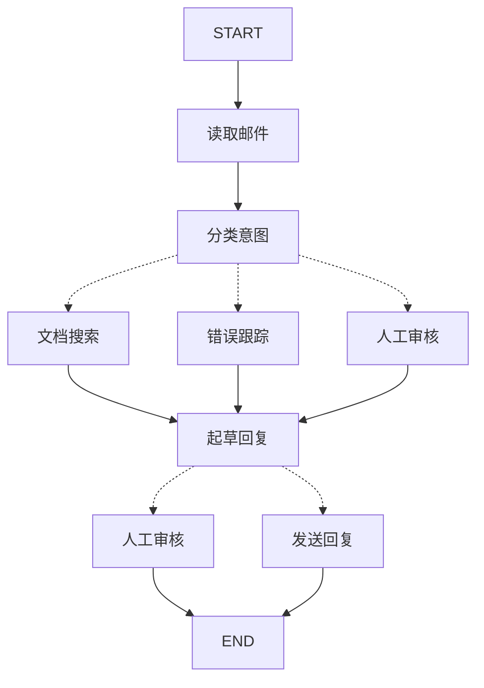

# 用 LangGraph 构建智能体：核心思维模式

> 通过将客户支持邮件代理分解为离散步骤，学习如何用 LangGraph 构建智能体的思维方式

LangGraph 能够改变你构建智能体的方式。当你使用 LangGraph 构建智能体时，首先需要将其拆分为称为**节点（nodes）**的离散步骤。然后，你需要描述每个节点的决策和转换路径。最后，通过一个共享的**状态（state）**连接所有节点，每个节点都可以读取和写入该状态。在本教程中，我们将引导你了解用 LangGraph 构建客户支持邮件代理的思维过程。

## 从需要自动化的流程开始

假设你需要构建一个处理客户支持邮件的 AI 代理。产品团队为你提出了以下需求：

代理应该能够：

* 阅读收到的客户邮件
* 按紧急程度和主题分类
* 搜索相关文档来回答问题
* 起草适当的回复
* 将复杂问题升级给人工代理
* 在需要时安排后续跟进

需要处理的示例场景：

1. 简单产品问题："如何重置我的密码？"
2. 错误报告："选择 PDF 格式时导出功能会崩溃"
3. 紧急账单问题："我的订阅被扣了两次费！"
4. 功能请求："可以在移动应用中添加深色模式吗？"
5. 复杂技术问题："我们的 API 集成间歇性地出现 504 错误"

要在 LangGraph 中实现代理，通常会遵循相同的五个步骤。

## 步骤 1：将工作流映射为离散步骤

首先识别流程中的不同步骤。每个步骤将成为一个**节点**（执行特定任务的函数）。然后勾勒这些步骤如何相互连接。



箭头显示可能的路径，但实际走哪条路径的决策发生在每个节点内部。

既然已经识别了工作流中的组件，让我们了解每个节点需要做什么：

* **读取邮件**：提取和解析邮件内容
* **分类意图**：使用 LLM 对紧急程度和主题进行分类，然后路由到适当的操作
* **文档搜索**：查询知识库获取相关信息
* **错误跟踪**：在跟踪系统中创建或更新问题
* **起草回复**：生成适当的回复
* **人工审核**：升级给人工代理进行审批或处理
* **发送回复**：发送邮件回复

<Tip>
  注意，有些节点决定下一步去哪里（分类意图、起草回复、人工审核），而其他节点总是进行到相同的下一步（读取邮件总是去分类意图，文档搜索总是去起草回复）。
</Tip>

## 步骤 2：确定每个步骤需要做什么

对于图中的每个节点，确定它代表什么类型的操作以及需要什么上下文才能正常工作。

<CardGroup cols={2}>
  <Card title="LLM 步骤" icon="brain" href="#llm-steps">
    当你需要理解、分析、生成文本或做出推理决策时使用
  </Card>

  <Card title="数据步骤" icon="database" href="#data-steps">
    当你需要从外部源检索信息时使用
  </Card>

  <Card title="操作步骤" icon="bolt" href="#action-steps">
    当你需要执行外部操作时使用
  </Card>

  <Card title="用户输入步骤" icon="user" href="#user-input-steps">
    当你需要人工干预时使用
  </Card>
</CardGroup>

### LLM 步骤

当步骤需要理解、分析、生成文本或做出推理决策时：

<AccordionGroup>
  <Accordion title="分类意图节点">
    * 静态上下文（提示词）：分类类别、紧急程度定义、响应格式
    * 动态上下文（来自状态）：邮件内容、发件人信息
    * 期望结果：决定路由的结构化分类
  </Accordion>

  <Accordion title="起草回复节点">
    * 静态上下文（提示词）：语气指南、公司政策、回复模板
    * 动态上下文（来自状态）：分类结果、搜索结果、客户历史
    * 期望结果：可供审核的专业邮件回复
  </Accordion>
</AccordionGroup>

### 数据步骤

当步骤需要从外部源检索信息时：

<AccordionGroup>
  <Accordion title="文档搜索节点">
    * 参数：根据意图和主题构建的查询
    * 重试策略：是的，对瞬态故障使用指数退避
    * 缓存：可以缓存常见查询以减少 API 调用
  </Accordion>

  <Accordion title="客户历史查询">
    * 参数：来自状态的客户邮箱或 ID
    * 重试策略：是的，但如果不可用则回退到基本信息
    * 缓存：是的，使用生存时间来平衡新鲜度和性能
  </Accordion>
</AccordionGroup>

### 操作步骤

当步骤需要执行外部操作时：

<AccordionGroup>
  <Accordion title="发送回复节点">
    * 执行时机：经批准后（人工或自动）
    * 重试策略：是的，对网络问题使用指数退避
    * 不应缓存：每次发送都是唯一的操作
  </Accordion>

  <Accordion title="错误跟踪节点">
    * 执行时机：意图为"错误"时总是执行
    * 重试策略：是的，关键是不丢失错误报告
    * 返回：要包含在回复中的工单 ID
  </Accordion>
</AccordionGroup>

### 用户输入步骤

当步骤需要人工干预时：

<AccordionGroup>
  <Accordion title="人工审核节点">
    * 决策上下文：原始邮件、草稿回复、紧急程度、分类
    * 期望输入格式：批准布尔值加上可选的编辑回复
    * 触发时机：高紧急程度、复杂问题或质量顾虑
  </Accordion>
</AccordionGroup>

## 步骤 3：设计你的状态

状态是代理中所有节点可访问的共享[记忆](/oss/javascript/concepts/memory)。把它想象成代理用来记录其在处理过程中所学和所决定的一切的笔记本。

### 什么应该属于状态？

对每个数据问自己这些问题：

<CardGroup cols={2}>
  <Card title="包含在状态中" icon="check">
    它是否需要在步骤间持久化？如果是，就放入状态。
  </Card>

  <Card title="不存储" icon="code">
    能否从其他数据推导出来？如果是，在需要时计算而不是存储在状态中。
  </Card>
</CardGroup>

对于我们的邮件代理，我们需要跟踪：

* 原始邮件和发件人信息（无法重构这些）
* 分类结果（多个下游节点需要）
* 搜索结果和客户数据（重新获取成本高）
* 草稿回复（需要在审核中保持）
* 执行元数据（用于调试和恢复）

### 保持状态原始，按需格式化提示

<Tip>
  关键原则：状态应存储原始数据，而不是格式化文本。在节点内部按需格式化提示。
</Tip>

这种分离意味着：

* 不同节点可以按不同方式格式化相同数据以满足其需求
* 可以更改提示模板而不修改状态架构
* 调试更清晰 - 你能准确看到每个节点接收到的数据
* 代理可以在不破坏现有状态的情况下发展

让我们定义状态：

```typescript  theme={null}
import * as z from "zod";

// 定义邮件分类的结构
const EmailClassificationSchema = z.object({
  intent: z.enum(["question", "bug", "billing", "feature", "complex"]),
  urgency: z.enum(["low", "medium", "high", "critical"]),
  topic: z.string(),
  summary: z.string(),
});

const EmailAgentState = z.object({
  // 原始邮件数据
  emailContent: z.string(),
  senderEmail: z.string(),
  emailId: z.string(),

  // 分类结果
  classification: EmailClassificationSchema.optional(),

  // 原始搜索/API 结果
  searchResults: z.array(z.string()).optional(),  // 原始文档块列表
  customerHistory: z.record(z.any()).optional(),  // 来自 CRM 的原始客户数据

  // 生成的内容
  responseText: z.string().optional(),
});

type EmailAgentStateType = z.infer<typeof EmailAgentState>;
type EmailClassificationType = z.infer<typeof EmailClassificationSchema>;
```

注意状态只包含原始数据 - 没有提示模板，没有格式化字符串，没有指令。分类输出作为单个字典直接从 LLM 存储。

## 步骤 4：构建节点

现在我们将每个步骤实现为函数。LangGraph 中的节点只是一个接收当前状态并返回对其更新的 JavaScript 函数。

### 恰当处理错误

不同错误需要不同的处理策略：

| 错误类型                                                      | 谁修复           | 策略                               | 使用时机                                         |
| ------------------------------------------------------------- | ---------------- | ---------------------------------- | ------------------------------------------------ |
| 瞬态错误（网络问题、速率限制）                                | 系统（自动）     | 重试策略                           | 通常在重试时解决的临时故障                       |
| LLM 可恢复错误（工具失败、解析问题）                          | LLM              | 将错误存储在状态中并循环返回       | LLM 可以看到错误并调整其方法                     |
| 用户可修复错误（信息缺失、指令不明确）                        | 人工             | 使用 `interrupt()` 暂停            | 需要用户输入才能继续                             |
| 意外错误                                                     | 开发者           | 让它们向上抛出                     | 需要调试的未知问题                               |

<Tabs>
  <Tab title="瞬态错误" icon="rotate">
    添加重试策略以自动重试网络问题和速率限制：

    ```typescript  theme={null}
    import type { RetryPolicy } from "@langchain/langgraph";

    workflow.addNode(
    "searchDocumentation",
    searchDocumentation,
    {
        retryPolicy: { maxAttempts: 3, initialInterval: 1.0 },
    },
    );
    ```
  </Tab>
  <Tab title="LLM 可恢复" icon="brain">
    将错误存储在状态中并循环返回，让 LLM 看到哪里出错了并重试：

    ```typescript  theme={null}
    import { Command } from "@langchain/langgraph";

    async function executeTool(state: State) {
    try {
        const result = await runTool(state.toolCall);
        return new Command({
        update: { toolResult: result },
        goto: "agent",
        });
    } catch (error) {
        // 让 LLM 看到出错的地方并重试
        return new Command({
        update: { toolResult: `Tool error: ${error}` },
        goto: "agent"
        });
    }
    }
    ```
  </Tab>
  <Tab title="用户可修复" icon="user">
    在需要时暂停并收集用户信息（如账户 ID、订单号或澄清）：

    ```typescript  theme={null}
    import { Command, interrupt } from "@langchain/langgraph";

    async function lookupCustomerHistory(state: State) {
    if (!state.customerId) {
        const userInput = interrupt({
        message: "需要客户 ID",
        request: "请提供客户的账户 ID 以查询其订阅历史",
        });
        return new Command({
        update: { customerId: userInput.customerId },
        goto: "lookupCustomerHistory",
        });
    }
    // 现在继续查询
    const customerData = await fetchCustomerHistory(state.customerId);
    return new Command({
        update: { customerHistory: customerData },
        goto: "draftResponse",
    });
    }
    ```
  </Tab>
  <Tab title="意外错误" icon="triangle-exclamation">
    让它们向上抛出进行调试。不要捕获你无法处理的内容：

    ```typescript  theme={null}
    async function sendReply(state: EmailAgentStateType): Promise<void> {
    try {
        await emailService.send(state.responseText);
    } catch (error) {
        throw error;  // 抛出意外错误
    }
    }
    ```
  </Tab>
</Tabs>

### 实现我们的邮件代理节点

我们将每个节点实现为简单函数。记住：节点接收状态，执行工作，返回更新。

<AccordionGroup>
  <Accordion title="读取和分类节点" icon="brain">
    ```typescript  theme={null}
    import { StateGraph, START, END, Command } from "@langchain/langgraph";
    import { HumanMessage } from "@langchain/core/messages";
    import { ChatAnthropic } from "@langchain/anthropic";

    const llm = new ChatAnthropic({ model: "claude-sonnet-4-5" });

    async function readEmail(state: EmailAgentStateType) {
    // 提取和解析邮件内容
    // 在生产环境中，这将连接到你的邮件服务
    console.log(`正在处理邮件: ${state.emailContent}`);
    return {};
    }

    async function classifyIntent(state: EmailAgentStateType) {
    // 使用 LLM 对邮件意图和紧急程度进行分类，然后相应地路由

    // 创建返回 EmailClassification 对象的结构化 LLM
    const structuredLlm = llm.withStructuredOutput(EmailClassificationSchema);

    // 按需格式化提示，不存储在状态中
    const classificationPrompt = `
    分析这封客户邮件并对其进行分类:

    邮件: ${state.emailContent}
    来自: ${state.senderEmail}

    提供包括意图、紧急程度、主题和摘要的分类。
    `;

    // 直接获取结构化响应作为对象
    const classification = await structuredLlm.invoke(classificationPrompt);

    // 根据分类确定下一个节点
    let nextNode: "searchDocumentation" | "humanReview" | "draftResponse" | "bugTracking";

    if (classification.intent === "billing" || classification.urgency === "critical") {
        nextNode = "humanReview";
    } else if (classification.intent === "question" || classification.intent === "feature") {
        nextNode = "searchDocumentation";
    } else if (classification.intent === "bug") {
        nextNode = "bugTracking";
    } else {
        nextNode = "draftResponse";
    }

    // 将分类作为单个对象存储在状态中
    return new Command({
        update: { classification },
        goto: nextNode,
    });
    }
    ```
  </Accordion>

  <Accordion title="搜索和跟踪节点" icon="database">
    ```typescript  theme={null}
    async function searchDocumentation(state: EmailAgentStateType) {
    // 搜索知识库获取相关信息

    // 根据分类构建搜索查询
    const classification = state.classification!;
    const query = `${classification.intent} ${classification.topic}`;

    let searchResults: string[];

    try {
        // 在这里实现你的搜索逻辑
        // 存储原始搜索结果，而不是格式化文本
        searchResults = [
        "通过 设置 > 安全 > 更改密码 重置密码",
        "密码必须至少 12 个字符",
        "包括大写字母、小写字母、数字和符号",
        ];
    } catch (error) {
        // 对于可恢复的搜索错误，存储错误并继续
        searchResults = [`搜索暂时不可用: ${error}`];
    }

    return new Command({
        update: { searchResults },  // 存储原始结果或错误
        goto: "draftResponse",
    });
    }

    async function bugTracking(state: EmailAgentStateType) {
    // 在错误跟踪系统中创建或更新错误工单

    // 在错误跟踪系统中创建工单
    const ticketId = "BUG-12345";  // 将通过 API 创建

    return new Command({
        update: { searchResults: [`错误工单 ${ticketId} 已创建`] },
        goto: "draftResponse",
    });
    }
    ```
  </Accordion>

  <Accordion title="响应节点" icon="pen-to-square">
    ```typescript  theme={null}
    import { Command, interrupt } from "@langchain/langgraph";

    async function draftResponse(state: EmailAgentStateType) {
    // 使用上下文生成响应并根据质量路由

    const classification = state.classification!;

    // 按需从原始状态数据格式化上下文
    const contextSections: string[] = [];

    if (state.searchResults) {
        // 为提示格式化搜索结果
        const formattedDocs = state.searchResults.map(doc => `- ${doc}`).join("\n");
        contextSections.push(`相关文档:\n${formattedDocs}`);
    }

    if (state.customerHistory) {
        // 为提示格式化客户数据
        contextSections.push(`客户等级: ${state.customerHistory.tier ?? "标准"}`);
    }

    // 使用格式化上下文构建提示
    const draftPrompt = `
    为这封客户邮件起草回复:
    ${state.emailContent}

    邮件意图: ${classification.intent}
    紧急程度: ${classification.urgency}

    ${contextSections.join("\n\n")}

    指南:
    - 专业且乐于助人
    - 解决他们的具体问题
    - 在相关时使用提供的文档
    `;

    const response = await llm.invoke([new HumanMessage(draftPrompt)]);

    // 根据紧急程度和意图确定是否需要人工审核
    const needsReview = (
        classification.urgency === "high" ||
        classification.urgency === "critical" ||
        classification.intent === "complex"
    );

    // 路由到适当的下一个节点
    const nextNode = needsReview ? "humanReview" : "sendReply";

    return new Command({
        update: { responseText: response.content.toString() },  // 仅存储原始响应
        goto: nextNode,
    });
    }

    async function humanReview(state: EmailAgentStateType) {
    // 使用 interrupt 暂停人工审核并根据决策路由
    const classification = state.classification!;

    // interrupt() 必须在前面 - 它之前的任何代码在恢复时都会重新运行
    const humanDecision = interrupt({
        emailId: state.emailId,
        originalEmail: state.emailContent,
        draftResponse: state.responseText,
        urgency: classification.urgency,
        intent: classification.intent,
        action: "请审核并批准/编辑此回复",
    });

    // 现在处理人工决策
    if (humanDecision.approved) {
        return new Command({
        update: { responseText: humanDecision.editedResponse || state.responseText },
        goto: "sendReply",
        });
    } else {
        // 拒绝意味着人工将直接处理
        return new Command({ update: {}, goto: END });
    }
    }

    async function sendReply(state: EmailAgentStateType): Promise<{}> {
    // 发送邮件回复
    // 与邮件服务集成
    console.log(`正在发送回复: ${state.responseText!.substring(0, 100)}...`);
    return {};
    }
    ```
  </Accordion>
</AccordionGroup>

## 步骤 5：连接所有部分

现在我们将节点连接成一个工作图。由于节点处理自己的路由决策，我们只需要一些基本边。

要使用 `interrupt()` 启用[人在回路](/oss/javascript/langgraph/interrupts)，我们需要用[检查点器](/oss/javascript/langgraph/persistence)编译以在运行间保存状态：

<Accordion title="图编译代码" icon="diagram-project" defaultOpen={true}>
  ```typescript  theme={null}
  import { MemorySaver, RetryPolicy } from "@langchain/langgraph";

  // 创建图
  const workflow = new StateGraph(EmailAgentState)
    // 添加节点并设置适当的错误处理
    .addNode("readEmail", readEmail)
    .addNode("classifyIntent", classifyIntent)
    // 为可能有瞬态故障的节点添加重试策略
    .addNode(
      "searchDocumentation",
      searchDocumentation,
      { retryPolicy: { maxAttempts: 3 } },
    )
    .addNode("bugTracking", bugTracking)
    .addNode("draftResponse", draftResponse)
    .addNode("humanReview", humanReview)
    .addNode("sendReply", sendReply)
    // 只添加必要的边
    .addEdge(START, "readEmail")
    .addEdge("readEmail", "classifyIntent")
    .addEdge("sendReply", END);

  // 用检查点器编译以实现持久化
  const memory = new MemorySaver();
  const app = workflow.compile({ checkpointer: memory });
  ```
</Accordion>

图结构是最小化的，因为路由通过 `Command` 对象在节点内部发生。每个节点声明它可以去哪里，使流程明确且可追踪。

### 试试你的代理

让我们用需要人工审核的紧急账单问题运行代理：

<Accordion title="测试代理" icon="flask">
  ```typescript  theme={null}
  // 用紧急账单问题测试
  const initialState: EmailAgentStateType = {
    emailContent: "我的订阅被扣了两次费！这很紧急！",
    senderEmail: "customer@example.com",
    emailId: "email_123"
  };

  // 用 thread_id 运行以实现持久化
  const config = { configurable: { thread_id: "customer_123" } };
  const result = await app.invoke(initialState, config);
  // 图将在 human_review 处暂停
  console.log(`草稿准备审核: ${result.responseText?.substring(0, 100)}...`);

  // 准备好后，提供人工输入以恢复
  import { Command } from "@langchain/langgraph";

  const humanResponse = new Command({
    resume: {
      approved: true,
      editedResponse: "我们真诚地为重复收费道歉。我已经启动了立即退款...",
    }
  });

  // 恢复执行
  const finalResult = await app.invoke(humanResponse, config);
  console.log("邮件发送成功！");
  ```
</Accordion>

图在遇到 `interrupt()` 时暂停，将所有内容保存到检查点器，并等待。它可以在几天后恢复，准确地从中断的地方继续。`thread_id` 确保此对话的所有状态一起保留。

## 总结和后续步骤

### 关键见解

构建这个邮件代理向我们展示了 LangGraph 的思维方式：

<CardGroup cols={2}>
  <Card title="分解为离散步骤" icon="sitemap" href="#step-1-map-out-your-workflow-as-discrete-steps">
    每个节点专注做好一件事。这种分解实现了流式进度更新、可以暂停和恢复的持久执行，以及清晰的调试，因为你可以检查步骤之间的状态。
  </Card>

  <Card title="状态是共享记忆" icon="database" href="#step-3-design-your-state">
    存储原始数据，而不是格式化文本。这让不同节点可以按不同方式使用相同信息。
  </Card>

  <Card title="节点是函数" icon="code" href="#step-4-build-your-nodes">
    它们接收状态，执行工作，返回更新。当需要做出路由决策时，它们同时指定状态更新和下一个目的地。
  </Card>

  <Card title="错误是流程的一部分" icon="triangle-exclamation" href="#handle-errors-appropriately">
    瞬态故障获得重试，LLM 可恢复错误带回上下文循环，用户可修复问题暂停等待输入，意外错误向上抛出进行调试。
  </Card>

  <Card title="人工输入是一等公民" icon="user" href="/oss/javascript/langgraph/interrupts">
    `interrupt()` 函数无限期暂停执行，保存所有状态，并在你提供输入时准确地从中断处继续。当与节点中的其他操作结合时，它必须放在第一位。
  </Card>

  <Card title="图结构自然浮现" icon="diagram-project" href="#step-5-wire-it-together">
    你定义基本连接，节点处理自己的路由逻辑。这保持控制流程明确且可追踪 - 你总是可以通过查看当前节点来理解代理下一步将做什么。
  </Card>
</CardGroup>

### 高级考虑因素

<Accordion title="节点粒度权衡" icon="sliders">
  <Info>
    本节探讨节点粒度设计的权衡。大多数应用可以跳过此部分，使用上面显示的模式。
  </Info>

  你可能想知道：为什么不将"读取邮件"和"分类意图"合并为一个节点？

  或者为什么将文档搜索与起草回复分开？

  答案涉及弹性和可观察性之间的权衡。

  **弹性考虑：** LangGraph 的[持久执行](/oss/javascript/langgraph/durable-execution)在节点边界创建检查点。当工作流在中断或故障后恢复时，它从执行停止的节点开始重新执行。较小的节点意味着更频繁的检查点，这意味着如果出现问题，需要重复的工作更少。如果将多个操作合并为一个大型节点，接近末尾的故障意味着从该节点开始重新执行所有操作。

  我们为邮件代理选择这种分解的原因：

  * **外部服务隔离：** 文档搜索和错误跟踪是单独的节点，因为它们调用外部 API。如果搜索服务慢或失败，我们希望将其与 LLM 调用隔离。我们可以向这些特定节点添加重试策略，而不影响其他节点。

  * **中间可见性：** 将"分类意图"作为自己的节点让我们可以在采取行动之前检查 LLM 的决定。这对调试和监控很有价值 - 你可以看到代理何时以及为什么路由到人工审核。

  * **不同故障模式：** LLM 调用、数据库查找和邮件发送有不同的重试策略。单独节点让你可以独立配置这些。

  * **可重用性和测试：** 较小的节点更容易隔离测试并在其他工作流中重用。

  另一种有效方法：你可以将"读取邮件"和"分类意图"合并为一个节点。你将失去在分类前检查原始邮件的能力，并且在该节点中的任何故障时都会重复两个操作。对于大多数应用，单独节点的可观察性和调试优势是值得的。

  应用级考虑：步骤 2 中的缓存讨论（是否缓存搜索结果）是应用级决策，不是 LangGraph 框架功能。你根据具体需求在节点函数内实现缓存 - LangGraph 不强制规定这一点。

  性能考虑：更多节点不意味着更慢的执行。LangGraph 默认在后台写入检查点（[异步持久模式](/oss/javascript/langgraph/durable-execution#durability-modes)），所以你的图继续运行而不等待检查点完成。这意味着你获得频繁检查点且性能影响最小。如果需要可以调整此行为 - 使用 `"exit"` 模式只在完成时检查点，或使用 `"sync"` 模式阻塞执行直到每个检查点写入。
</Accordion>

### 从这里到哪里去

这只是介绍用 LangGraph 构建智能体的思维方式。你可以用以下内容扩展这个基础：

<CardGroup cols={2}>
  <Card title="人在回路模式" icon="user-check" href="/oss/javascript/langgraph/interrupts">
    学习如何添加工具执行前审批、批量审批和其他模式
  </Card>

  <Card title="子图" icon="diagram-nested" href="/oss/javascript/langgraph/use-subgraphs">
    为复杂的多步操作创建子图
  </Card>

  <Card title="流式传输" icon="tower-broadcast" href="/oss/javascript/langgraph/streaming">
    添加流式传输以向用户显示实时进度
  </Card>

  <Card title="可观察性" icon="chart-line" href="/oss/javascript/langgraph/observability">
    用 LangSmith 添加可观察性进行调试和监控
  </Card>

  <Card title="工具集成" icon="wrench" href="/oss/javascript/langchain/tools">
    集成更多工具进行网络搜索、数据库查询和 API 调用
  </Card>

  <Card title="重试逻辑" icon="rotate" href="/oss/javascript/langgraph/use-graph-api#add-retry-policies">
    为失败操作实现带指数退避的重试逻辑
  </Card>
</CardGroup>

***

<Callout icon="pen-to-square" iconType="regular">
  [在 GitHub 上编辑此页面的源代码。](https://github.com/langchain-ai/docs/edit/main/src/oss/langgraph/thinking-in-langgraph.mdx)
</Callout>

<Tip icon="terminal" iconType="regular">
  [通过 MCP 以编程方式连接这些文档](/use-these-docs)到 Claude、VSCode 等，以获得实时答案。
</Tip>